# 使用 Mermaid Script 繪製圖表

## 需求圖

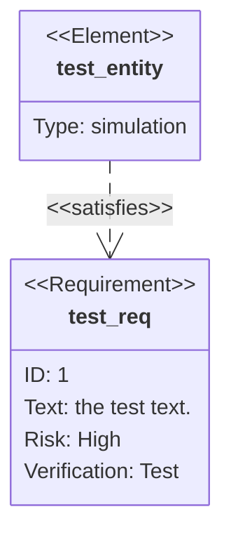
```mermaid
requirementDiagram

    requirement test_req {
    id: 1
    text: the test text.
    risk: high
    verifymethod: test
    }

    element test_entity {
    type: simulation
    }

    test_entity - satisfies -> test_req
```

## 循序圖

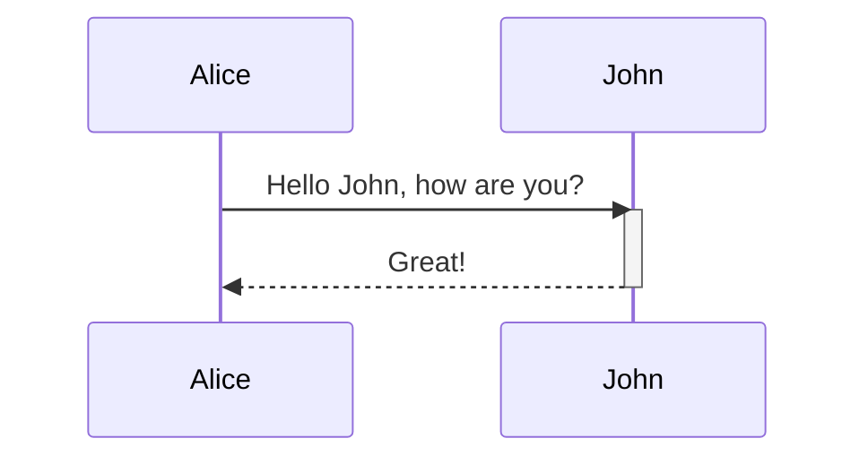
```mermaid
sequenceDiagram
    Alice->>John: Hello John, how are you?
    activate John
    John-->>Alice: Great!
    deactivate John
```

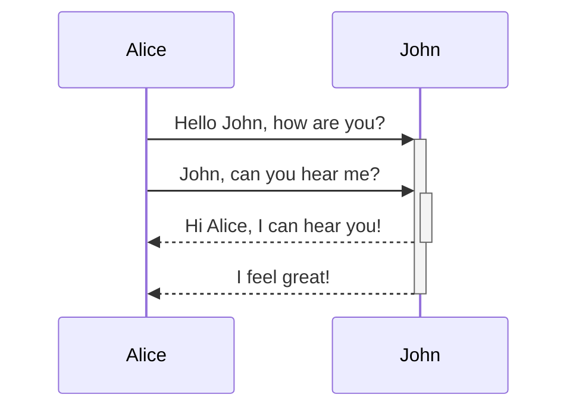
```mermaid
sequenceDiagram
    Alice->>+John: Hello John, how are you?
    Alice->>+John: John, can you hear me?
    John-->>-Alice: Hi Alice, I can hear you!
    John-->>-Alice: I feel great!
```

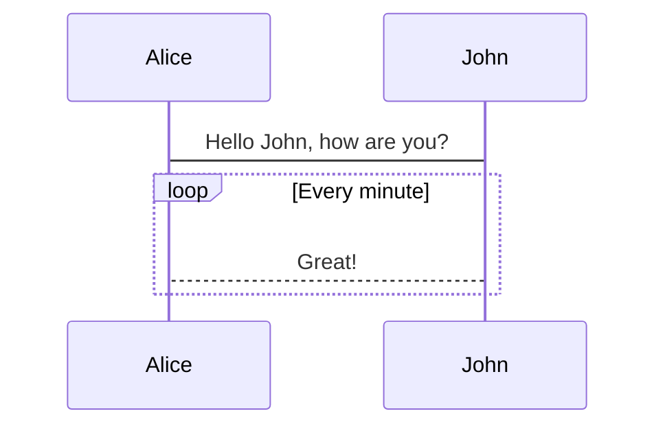
```mermaid
sequenceDiagram
    Alice->John: Hello John, how are you?
    loop Every minute
        John-->Alice: Great!
    end
```

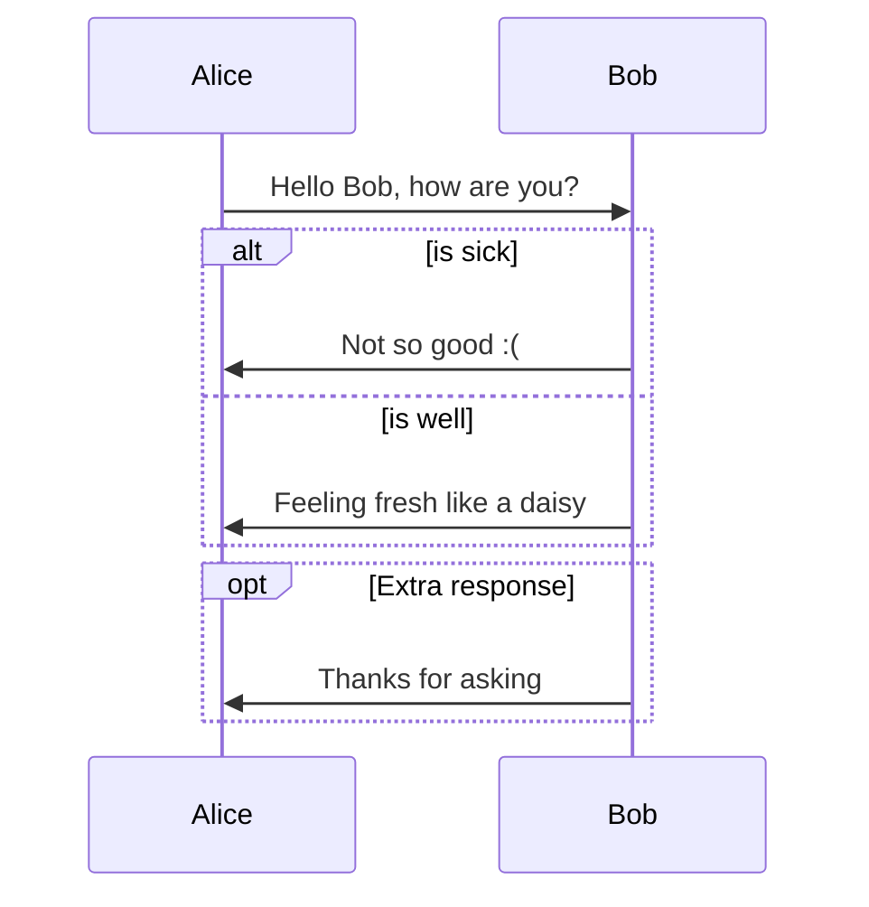
```mermaid
sequenceDiagram
    Alice->>Bob: Hello Bob, how are you?
    alt is sick
        Bob->>Alice: Not so good :(
    else is well
        Bob->>Alice: Feeling fresh like a daisy
    end
    opt Extra response
        Bob->>Alice: Thanks for asking
    end
```

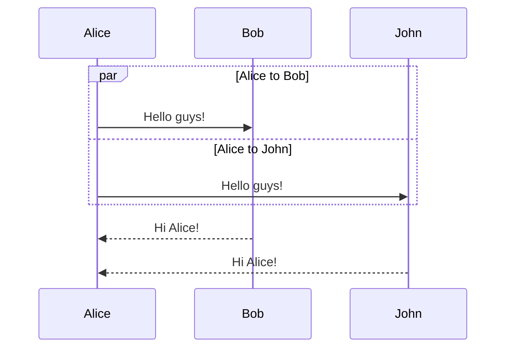
```mermaid
sequenceDiagram
    par Alice to Bob
        Alice->>Bob: Hello guys!
    and Alice to John
        Alice->>John: Hello guys!
    end
    Bob-->>Alice: Hi Alice!
    John-->>Alice: Hi Alice!
```

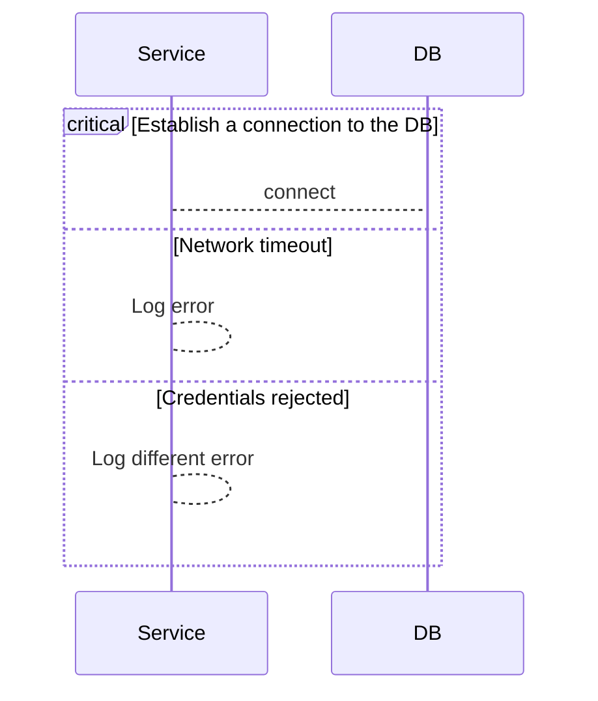
```mermaid
sequenceDiagram
    critical Establish a connection to the DB
        Service-->DB: connect
    option Network timeout
        Service-->Service: Log error
    option Credentials rejected
        Service-->Service: Log different error
    end
```

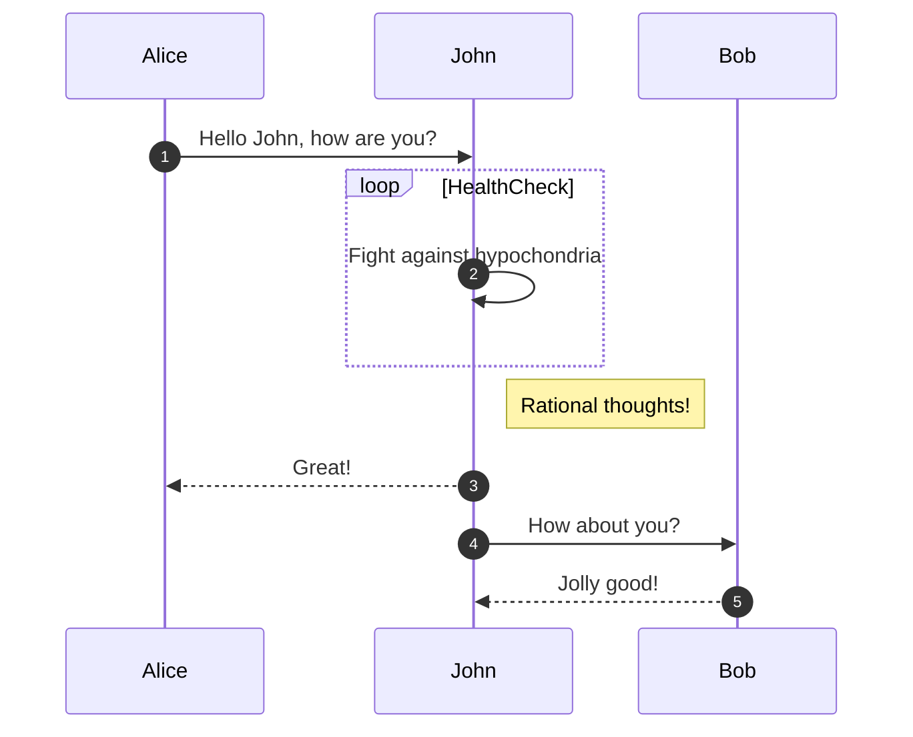
```mermaid
sequenceDiagram
    autonumber
    Alice->>John: Hello John, how are you?
    loop HealthCheck
        John->>John: Fight against hypochondria
    end
    Note right of John: Rational thoughts!
    John-->>Alice: Great!
    John->>Bob: How about you?
    Bob-->>John: Jolly good!
```

## 類別圖

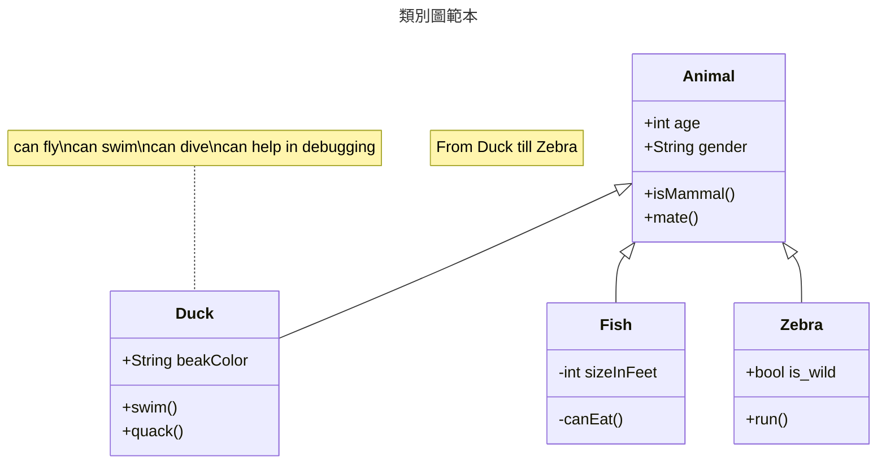
```mermaid
---
title: 類別圖範本
---
classDiagram
    note "From Duck till Zebra"
    Animal <|-- Duck
    note for Duck "can fly\ncan swim\ncan dive\ncan help in debugging"
    Animal <|-- Fish
    Animal <|-- Zebra
    Animal : +int age
    Animal : +String gender
    Animal: +isMammal()
    Animal: +mate()
    class Duck{
        +String beakColor
        +swim()
        +quack()
    }
    class Fish{
        -int sizeInFeet
        -canEat()
    }
    class Zebra{
        +bool is_wild
        +run()
    }
```

## 流程圖

### 基礎流程圖

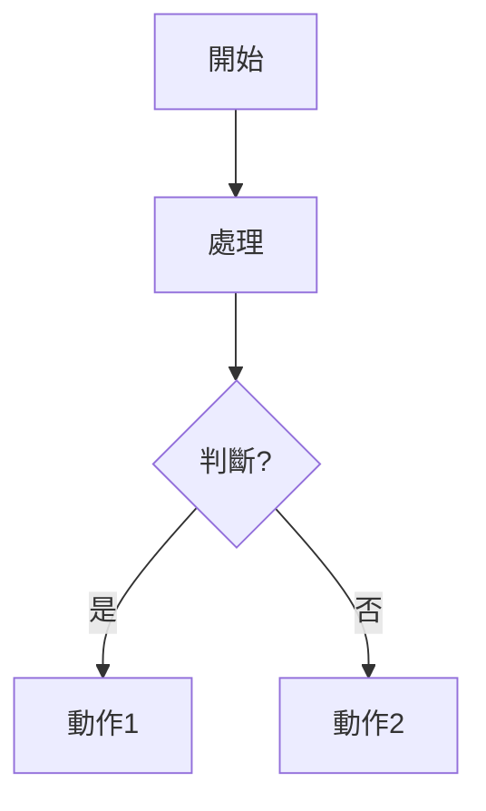
```mermaid
graph TD
  A[開始] --> B[處理]
  B --> C{判斷?}
  C -->|是| D[動作1]
  C -->|否| E[動作2]
```

### 程式流程圖

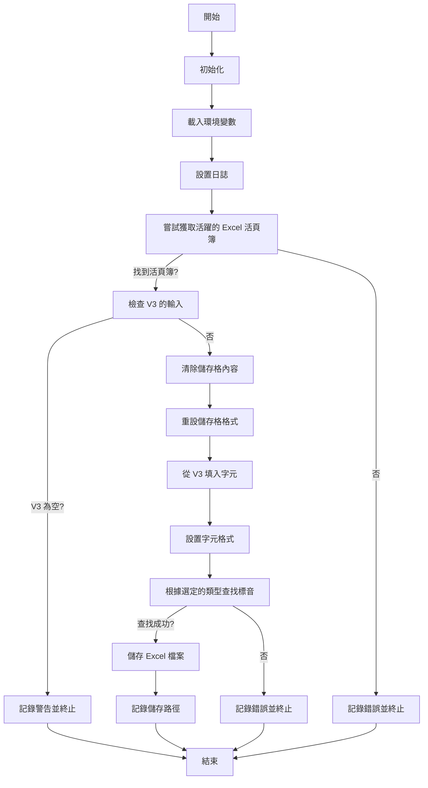
```mermaid
flowchart TD
    A[開始] --> B[初始化]
    B --> C[載入環境變數]
    C --> D[設置日誌]
    D --> E[嘗試獲取活躍的 Excel 活頁簿]
    E -->|找到活頁簿?| F[檢查 V3 的輸入]
    E -->|否| G[記錄錯誤並終止]
    F -->|V3 為空?| H[記錄警告並終止]
    F -->|否| I[清除儲存格內容]
    I --> J[重設儲存格格式]
    J --> K[從 V3 填入字元]
    K --> L[設置字元格式]
    L --> M[根據選定的類型查找標音]
    M -->|查找成功?| N[儲存 Excel 檔案]
    M -->|否| O[記錄錯誤並終止]
    N --> P[記錄儲存路徑]
    P --> Q[結束]
    G --> Q
    H --> Q
    O --> Q
```

## 狀態圖

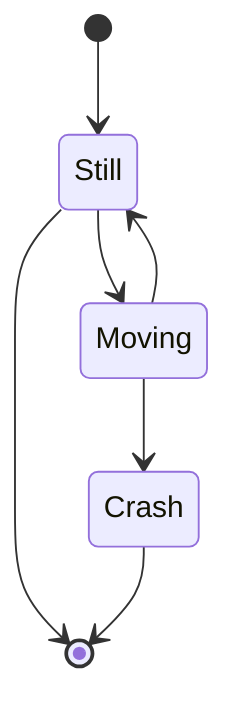
```mermaid
stateDiagram-v2
    [*] --> Still
    Still --> [*]
    Still --> Moving
    Moving --> Still
    Moving --> Crash
    Crash --> [*]
```

## 系統架構圖

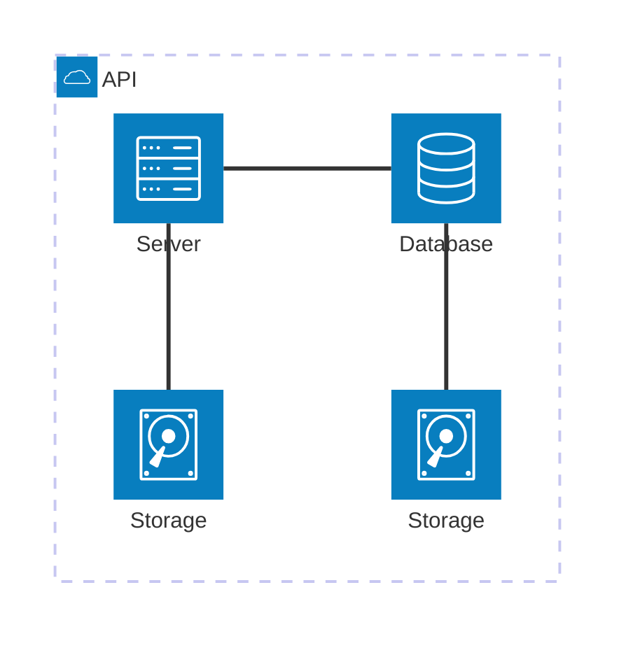
```mermaid
architecture-beta
    group api(cloud)[API]

    service db(database)[Database] in api
    service disk1(disk)[Storage] in api
    service disk2(disk)[Storage] in api
    service server(server)[Server] in api

    db:L -- R:server
    disk1:T -- B:server
    disk2:T -- B:db
```

## 資料結構圖

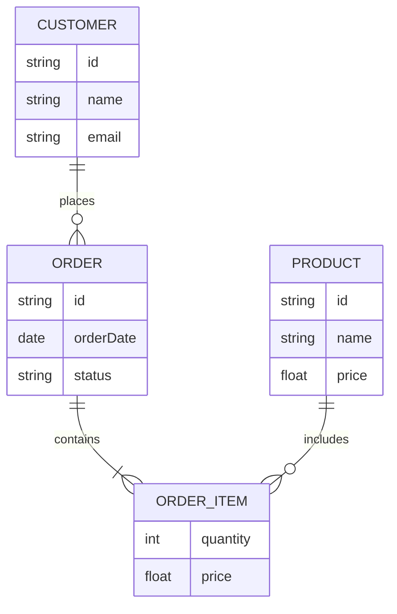
```mermaid
erDiagram
    CUSTOMER ||--o{ ORDER : places
    ORDER ||--|{ ORDER_ITEM : contains
    PRODUCT ||--o{ ORDER_ITEM : includes
    CUSTOMER {
        string id
        string name
        string email
    }
    ORDER {
        string id
        date orderDate
        string status
    }
    PRODUCT {
        string id
        string name
        float price
    }
    ORDER_ITEM {
        int quantity
        float price
    }
```

## 心智圖

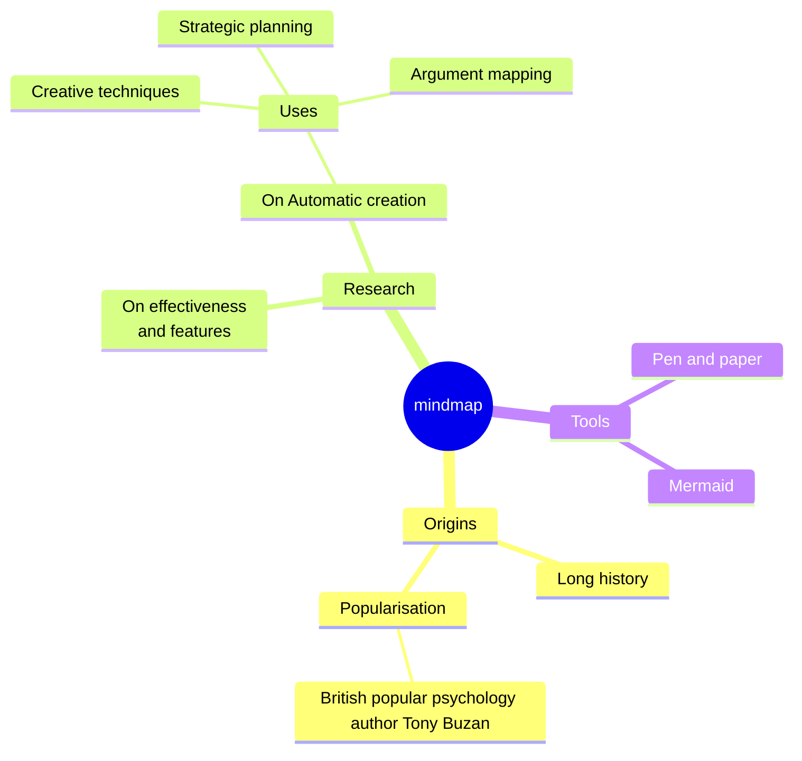
```mermaid
mindmap
  root((mindmap))
    Origins
      Long history
      ::icon(fa fa-book)
      Popularisation
        British popular psychology author Tony Buzan
    Research
      On effectiveness<br/>and features
      On Automatic creation
        Uses
            Creative techniques
            Strategic planning
            Argument mapping
    Tools
      Pen and paper
      Mermaid
```
